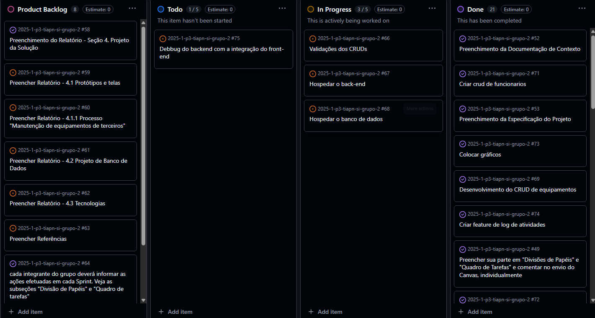

# Metodologia

Pré-requisitos: [Especificação do projeto](02-Especificacao.md)

Adotamos uma abordagem organizada e colaborativa para atender a todos os requisitos das três Sprints estabelecidas pela disciplina de TIAPN. Para garantir o cumprimento de prazos e a qualidade dos artefatos, utilizamos as seguintes ferramentas:

- **Trello** – Organização interna das tarefas, principalmente no início do projeto. Facilita a visualização do fluxo de trabalho e o acompanhamento das etapas.
- **Bizagi Modeler** – Confecção dos Diagramas AS‑IS e TO‑BE em notação BPMN, com validador integrado que assegura a integridade e qualidade dos modelos.
- **Figma** – Plataforma para criação de wireframes e protótipos interativos da SPA, permitindo refinar a experiência do usuário antes da implementação.
- **GitHub** – Hospedagem e versionamento do código‑fonte. Gerenciamos o desenvolvimento por meio de branches, commits e pull requests, garantindo rastreabilidade e integração contínua.
- **GitHub Projects** – Gerenciamento das Sprints e acompanhamento das tarefas a partir da Sprint 2, substituindo o Trello.
- **WhatsApp** – Comunicação rápida e informal entre os membros do grupo.
- **Microsoft Teams** – Encontros remotos e videoconferências em situações emergenciais ou para reuniões de Sprint Review/Planning.

## Processo e Gestão de Equipes

Seguimos o framework Scrum, com ciclos de Sprint de duas semanas. Cada Sprint inicia com uma reunião de planejamento (_Sprint Planning_), na qual definimos o backlog e estimamos as tarefas. Durante a Sprint, as atividades são acompanhadas no **GitHub Projects**, onde usamos um quadro Kanban para visualizar o progresso. As reuniões de acompanhamento (_Daily Stand‑ups_) ocorrem às sextas-feiras, e reuniões extras são convocadas via **Microsoft Teams** sempre que surgem impedimentos. Ao final de cada Sprint, realizamos a **Sprint Review** para demonstrar os entregáveis e a **Retrospectiva** para identificar melhorias no processo. O **Scrum Master** garante que o time siga as práticas ágeis, enquanto o **Product Owner** prioriza o backlog e valida os requisitos.

### Github Projects

## Controle de versão

Utilizamos o **Git** (https://git-scm.com/) como sistema de controle de versão e o **GitHub** (https://github.com) para hospedagem do repositório. A convenção de branches adotada é:

- `main`: versão estável já testada do software.
- `release`: versão estável com novas implementações provenientes da branch `development`.
- `bugfix`: correção de erros e exceções.
- `feature`: implementação de funcionalidades específicas.
- `development`: branch de desenvolvimento principal.

Essa configuração de branches foi estabelecida em concordância com os membros do grupo. Optamos por essa estrutura por ser fácil e se encaixar bem no nosso projeto. As issues seguirão essa estrutura na elaboração e gerenciamento das Sprints.

## Planejamento do projeto

### Divisão de papéis

#### Sprint 1

- _Scrum Master_: Arthur Lima Camargos  
- Contexto: Arthur Lima Camargos  
- Especificação: Caio Martins Bicalho da Costa, João Vitor Vitalino da Silva Roveda e Vitor Mendonça Braga  
- Metodologia: Daniel Heringer Verner Silva e Vitor Mendonça Braga  
- README: João Vitor Vitalino da Silva Roveda  
- Slide de Apresentação: Daniel Heringer Verner Silva  
- Template: Daniel de Queiroz Fernandes  

#### Sprint 2

- _Scrum Master_: Daniel Heringer Verner Silva  
- Product Owner: Arthur Lima Camargos  
- Slide de Apresentação: Daniel de Queiroz Fernandes  
- Modelagem de Processos de Negócio: Vitor Mendonça Braga e Caio Martins Bicalho da Costa  
- Diagrama AS‑IS: Daniel Heringer Verner Silva  
- Diagrama TO‑BE: Daniel Heringer Verner Silva  
- Metodologia: Arthur Lima Camargos  
- Template (Parte 3.3): João Vitor Vitalino da Silva Roveda  
- Referências: João Vitor Vitalino da Silva Roveda

#### Sprint 3

- _Scrum Master_: Daniel de Queiroz Fernandes
- Diagrama Peter Chen: Daniel Heringer Verner Silva
- Diagrama Relacional (Pé de Galinha): Daniel de Queiroz Fernandes e Daniel Heringer Verner Silva
- Template: Daniel Heringer Verner Silva, Daniel de Queiroz Fernandes e João Vitor Vitalino da Silva Roveda
- Jornada do usuário: Vitor Mendonça
- Diagrama de fluxo: Vitor Mendonça

#### Sprint 4

- _Scrum Master_:  Vitor Mendonça
- Banco de Dados: Daniel Heringer Verner Silva
- BackEnd: Caio Martins, Daniel Heringer e João Roveda
- FrontEnd: Arthur Lima, Daniel de Queiroz e Vitor Mendonça
- Slides de apresentação:: Vitor Mendonça

### Quadro de tarefas

#### Sprint 1

_Atualizado em: 12/03/2025_

| Responsável            | Tarefa/Requisito                                 | Iniciado em | Prazo       | Status | Terminado em |
| :--------------------- | :----------------------------------------------- | :---------: | :---------: | :----: | :----------: |
| Arthur Lima Camargos   | Introdução                                       | 08/03/2025  | 13/03/2025  | ✔️     | 09/03/2025   |
| Caio Martins           | Especificação do projeto                         | 08/03/2025  | 10/03/2025  | ✔️     | 09/03/2025   |
| Daniel de Queiroz      | Template do relatório                            | 10/03/2025  | 13/03/2025  | ✔️     | 13/03/2025   |
| Daniel Heringer Verner Silva        | Slide de apresentação                            | 10/03/2025  | 12/03/2025  | ✔️     | 10/03/2025   |
| João Vitor Roveda      | Objetivos                                        | 07/03/2025  | 10/03/2025  | ✔️     | 09/03/2025   |
| Vitor Mendonça Braga   | Personas e histórias de usuários                  | 08/03/2025  | 10/03/2025  | ✔️     | 09/03/2025   |

#### Sprint 2

_Atualizado em: 21/04/2025_

| Responsável                           | Tarefa/Requisito                           | Iniciado em | Prazo       | Status | Terminado em |
| :------------------------------------ | :----------------------------------------- | :---------: | :---------: | :----: | :----------: |
| Daniel Heringer Verner Silva          | Scrum Master                               | 05/04/2025  | 10/04/2025  | ✔️     | 09/04/2025   |
| Arthur Lima Camargos                  | Product Owner                              | 05/04/2025  | 10/04/2025  | ✔️     | 09/04/2025   |
| Daniel de Queiroz Fernandes           | Slide de Apresentação                      | 03/04/2025  | 10/04/2025  | ✔️     | 09/04/2025   |
| Vitor Mendonça Braga                  | Modelagem de Processos de Negócio (BPMN)    | 05/04/2025  | 10/04/2025  | ✔️     | 09/04/2025   |
| Caio Martins Bicalho da Costa         | Modelagem de Processos de Negócio (BPMN)    | 04/04/2025  | 10/04/2025  | ✔️     | 09/04/2025   |
| Daniel Heringer Verner Silva          | Diagrama AS‑IS                              | 05/04/2025  | 10/04/2025  | ✔️     | 09/04/2025   |
| Daniel Heringer Verner Silva          | Diagrama TO‑BE                              | 02/04/2025  | 10/04/2025  | ✔️     | 09/04/2025   |
| Arthur Lima Camargos                  | Metodologia                                 | 05/04/2025  | 10/04/2025  | ✔️     | 09/04/2025   |
| João Vitor Vitalino da Silva Roveda   | Template (Parte 3.3)                        | 05/04/2025  | 10/04/2025  | ✔️     | 09/04/2025   |
| João Vitor Vitalino da Silva Roveda   | Referências                                 | 05/04/2025  | 10/04/2025  | ✔️     | 09/04/2025   |

#### Sprint 3

_Atualizado em: 08/05/2025_

| Responsável            | Tarefa/Requisito                                 | Iniciado em | Prazo       | Status | Terminado em |
| :--------------------- | :----------------------------------------------- | :---------: | :---------: | :----: | :----------: |
| Arthur Lima Camargos   |  Arquitetura da Solução | 28/04/2025  | 08/05/2025  | ✔️     | 08/05/2025   |
| Caio Martins           |  Slides de Apresentação                        | 06/05/2025  | 08/05/2025  | ✔️     | 07/05/2025   |
| Daniel de Queiroz      | Diagrama Pé de galinha; Relatório-Template | 21/04/2025  | 08/05/2025  | ✔️    | 01/05/2025   |
| Daniel Heringer Verner Silva        | Diagrama Peter Chen; Relatório-Template; | 21/04/2025  | 08/05/2025  | ✔️     | 01/05/2025 |
| João Vitor Roveda      |       Wireframes e userflow                                | 01/05/2025  | 08/05/2025  | ✔️     | 08/05/2025   |
| Vitor Mendonça Braga   | Jornada do usuário e diagrama de fluxo                 | 04/05/2025  | 8/05/2025  | ✔️     | 07/05/2025   |

#### Sprint 4
_Atualizado em: 04/06/2025_

| Responsável            | Tarefa/Requisito                                 | Iniciado em | Prazo       | Status | Terminado em |
| :--------------------- | :----------------------------------------------- | :---------: | :---------: | :----: | :----------: |
| Arthur Lima Camargos   | Feature para preenchimento automatico do ClientForm a partir de um CNPJ | 28/05/2025  | 04/05/2025  | ✔️     | 08/05/2025   |
| Caio Martins           |Implementação das rotas e controllers do backend, juntamente com a criação dos artefatos relacionados a cliente, equipamento e serviços, estabelecendo a conexão com o banco de dados por meio do backend.| 30/5/2025  | 05/06/2025  | ✔️     | 05/06/2025   |
| Daniel de Queiroz      | CRUD de equipamentos | 28/05/2025  | 05/06/2025  | ✔️    | 05/06/2025   |
| Daniel Heringer Verner Silva        | Banco de Dados | 31/05/2025  | 05/06/2025  | ✔️     | 31/05/2025 |
| Daniel Heringer Verner Silva        | FuncionarioController.js/funcionarioRoutes.js (BackEnd) | 04/06/2025  | 05/06/2025  | ✔️     | 04/06/2025 |
| João Vitor Roveda      |  Implementação do backend de serviços, ordem de serviços e parcialmente os clientes                                 | 01/05/2025  | 04/06/2025  | ✔️     | 04/06/2025   |
| Vitor Mendonça Braga   | CRUD de acessos de usuários, CRUD de clientes e Login| 27/05/2025  | 5/06/2025  | ✔️     | 4/06/2025    |

Legenda:  
✔️: terminado 
📝: em execução 
⌛: atrasado 
❌: não iniciado

### Ferramentas

| Ferramenta            | Propósito                                       | Justificativa                                                        |
|-----------------------|-------------------------------------------------|----------------------------------------------------------------------|
| Trello                | Organização interna de tarefas                  | Visualização clara do fluxo e fácil acompanhamento                   |
| Bizagi Modeler        | Modelagem de processos AS‑IS e TO‑BE (BPMN)      | Validador integrado garante integridade e qualidade dos diagramas    |
| Figma                 | Criação de wireframes e protótipos interativos  | Permite refinar a experiência do usuário antes da implementação      |
| GitHub                | Hospedagem e versionamento de código            | Fluxo colaborativo com branches, commits e pull requests             |
| GitHub Projects       | Gerenciamento de Sprints e acompanhamento       | Quadro Kanban integrado ao repositório                               |
| WhatsApp              | Comunicação instantânea                         | Agilidade na troca de informações entre membros                      |
| Microsoft Teams       | Reuniões remotas e videoconferências            | Suporte a videoconferência e compartilhamento de tela em tempo real  |
