# Projeto de interface

Pré-requisitos: <a href="02-Especificacao.md"> Especificação do projeto</a>

Visão geral da interação do usuário pelas telas do sistema e protótipo interativo das telas com as funcionalidades que fazem parte do sistema (wireframes).

 Apresente as principais interfaces da plataforma. Discuta como ela foi elaborada de forma a atender os requisitos funcionais, não funcionais e histórias de usuário abordados na <a href="02-Especificacao.md"> Especificação do projeto</a>.

 ## User flow

Fluxo de usuário (user flow) é uma técnica que permite ao desenvolvedor mapear todo o fluxo de navegação do usuário na aplicação. Essa técnica serve para alinhar os caminhos e as possíveis ações que o usuário pode realizar junto com os membros da equipe.

> **Links úteis**:
> - [User flow: o quê é e como fazer?](https://medium.com/7bits/fluxo-de-usu%C3%A1rio-user-flow-o-que-%C3%A9-como-fazer-79d965872534)
> - [User flow vs site maps](http://designr.com.br/sitemap-e-user-flow-quais-as-diferencas-e-quando-usar-cada-um/)
> - [Top 25 user flow tools & templates for smooth](https://www.mockplus.com/blog/post/user-flow-tools)

### Diagrama de fluxo

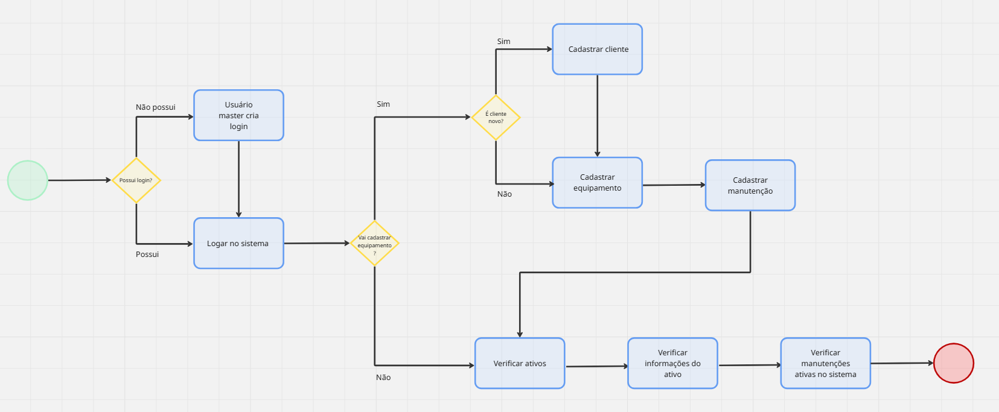

## Wireframes

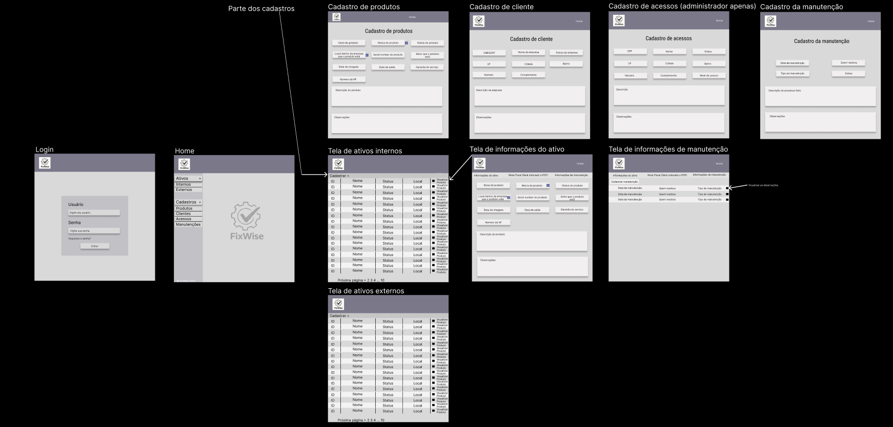
 

## Interface do sistema

###  Telas de login

Tela de login

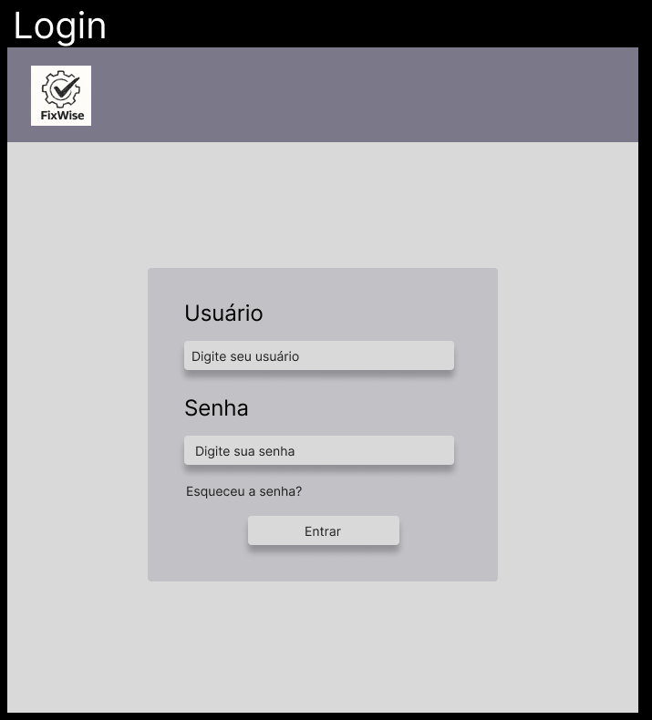

### Tela Home

Tela de home

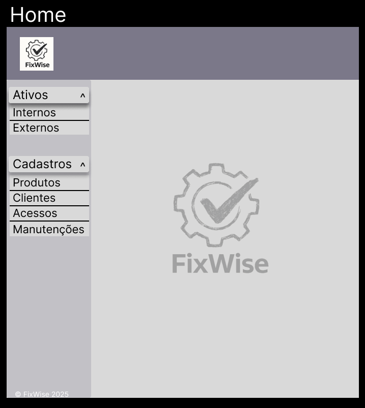

### Tela de ativos 

Ativos internos

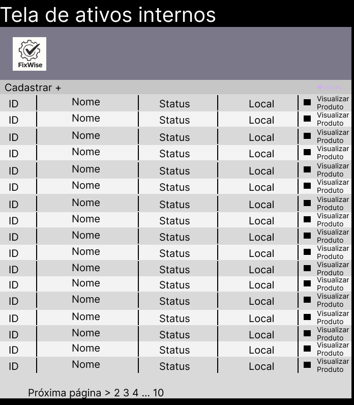

Ativos Externos

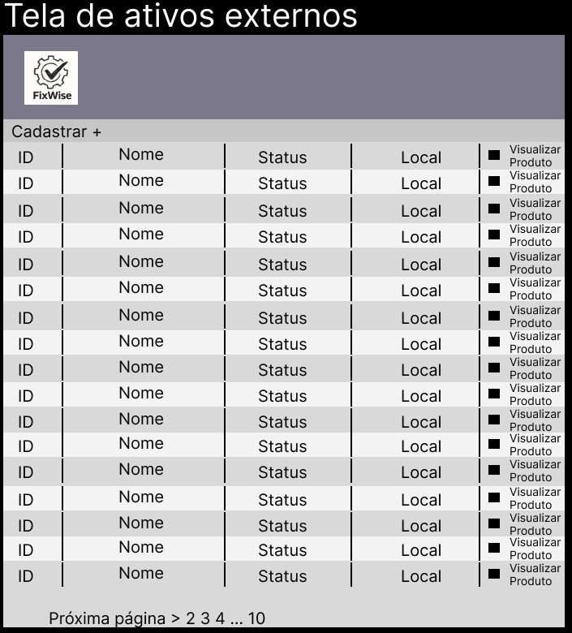

*Tela ao selecionar o ativo*

Informações do ativo

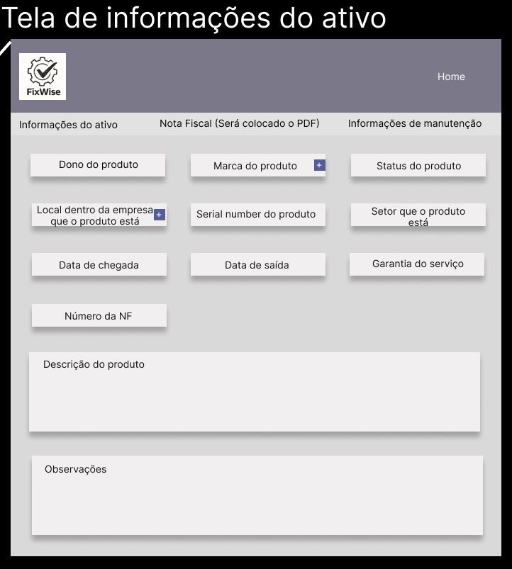

Informações de manutenção

### Telas de cadastros

*Tela cadastro de produtos*

Cadastro de produtos

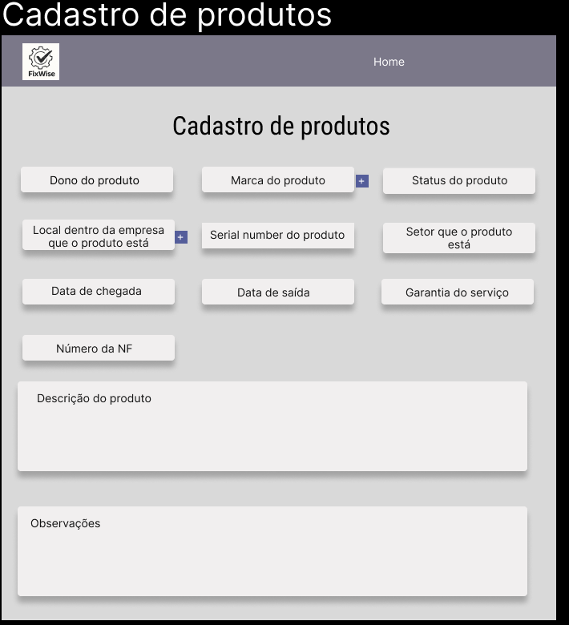

*Tela cadastro de clientes*

Cadastro de cliente

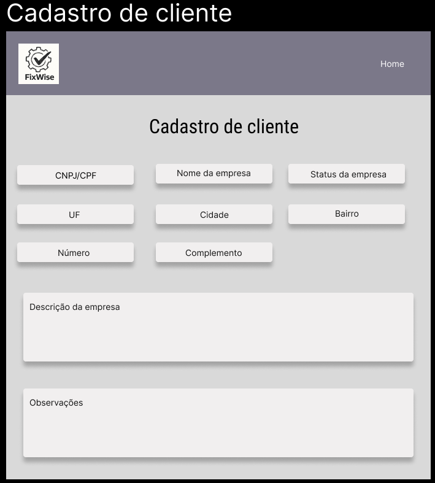

*Tela cadastro de acessos*

Cadastro de acessos

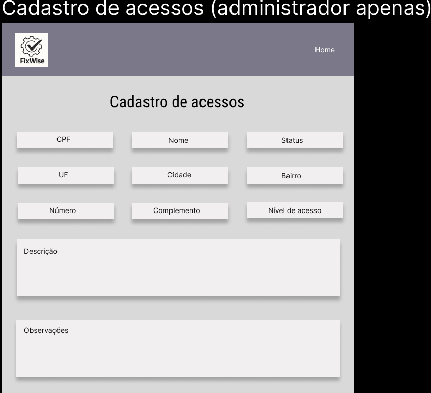

*Tela cadastro de manutenção*

Cadastro de manutenção

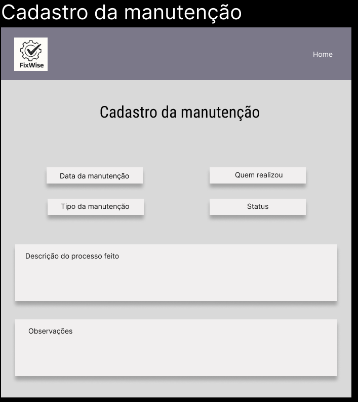
