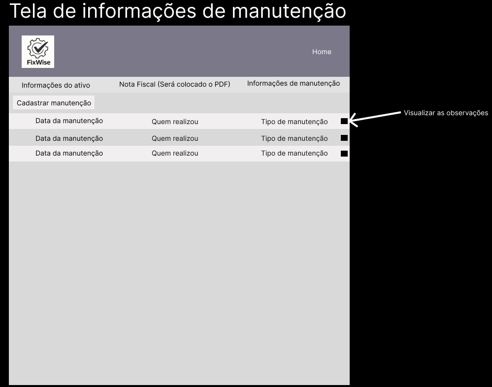

# Projeto de interface

Nesta aba, vamos apresentar o projeto de interface do nosso sistema, incluindo os wireframes, o diagrama de fluxo e o user flow. Esses elementos visuais foram desenvolvidos com base nas necessidades dos usuários e nos requisitos funcionais e não funcionais previamente levantados, garantindo uma experiência intuitiva, eficiente e centrada no usuário.

O objetivo principal do software é registrar e atualizar o status das manutenções de forma rápida e organizada, permitindo que técnicos e supervisores acompanhem o andamento das manutenções em tempo real. Além disso, o sistema oferece a possibilidade de consultar rapidamente o status das ordens de serviço e monitorar todas as manutenções de forma centralizada, promovendo mais controle, agilidade e eficiência na gestão dos serviços.

Com essas funcionalidades, buscamos atender às demandas dos diferentes perfis de usuários. Garantindo uma plataforma com uma interface simples e fácil de usar.
 ## User flow

### Diagrama de fluxo

## Wireframes e suas descrições

 

## Interface do sistema

##  Telas de login

### Tela de login

- Tela de login com usuário e senha com opção de recuperação de senha.

## Tela Home

### Tela de home

- Usuário seleciona entre visualizar ativos internos e externos, cadastrar produtos, clientes, acessos e manutenções.

## Tela de ativos 

### Ativos internos

- Usuário visualiza os equipamentos internos em manutenção.
- Possibilidade de visualizar os status dos equipamentos de maneira rápida e fácil.
- Usuário pode cadastrar novos equipamentos.

### Ativos Externos

- Usuário visualiza os equipamentos externos em manutenção.
- Possibilidade de visualizar os status dos equipamentos de maneira rápida e fácil.
- Usuário pode cadastrar novos equipamentos.

## *Tela ao selecionar o ativo*

### Informações do ativo

- Usuário visualiza as informações do equipamento selecionado com possibilidade de implementação de marca e local na empresa.

### Informações de manutenção

- Usuário visualiza as manutenções ativas no sistema.
- Pode verificar as observações da manutenção ao clicar no botão .

## Telas de cadastros

*Tela cadastro de produtos*

### Cadastro de produtos

- Usuário registra um equipamento, define o status do produto (ativo/inativo), insere os dados principais, chegada, saída, nota fiscal, além da descrição e observações referentes ao produto.
- Seleciona o cliente para qual aquele equipamento pertence.

*Tela cadastro de clientes*

### Cadastro de cliente

- Usuário cadastra o cliente, sendo pessoa física ou jurídica preenchendo os dados de acordo.

*Tela cadastro de acessos*

### Cadastro de acessos

- Usuário cria acesso para os demais funcionários da empresa, inserindo os dados pessoais do funcionario, o status na empresa e o nível de acesso ao sistema, além de descrições e observações.
- Somente o usuário master terá acesso.
  

*Tela cadastro de manutenção*

### Cadastro de manutenção

- Usuário cadastra a manutenção que será realizada definindo data que foi realizada, quem realizou, o tipo da manutenção e o status atual, além de descrição e observações sobre.
