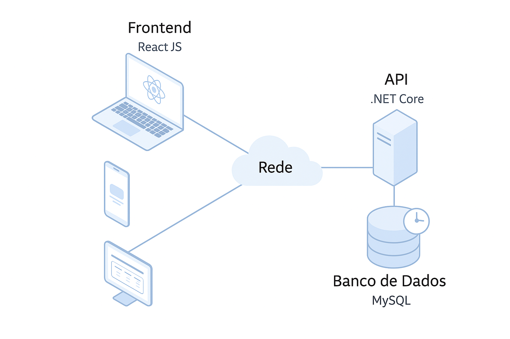
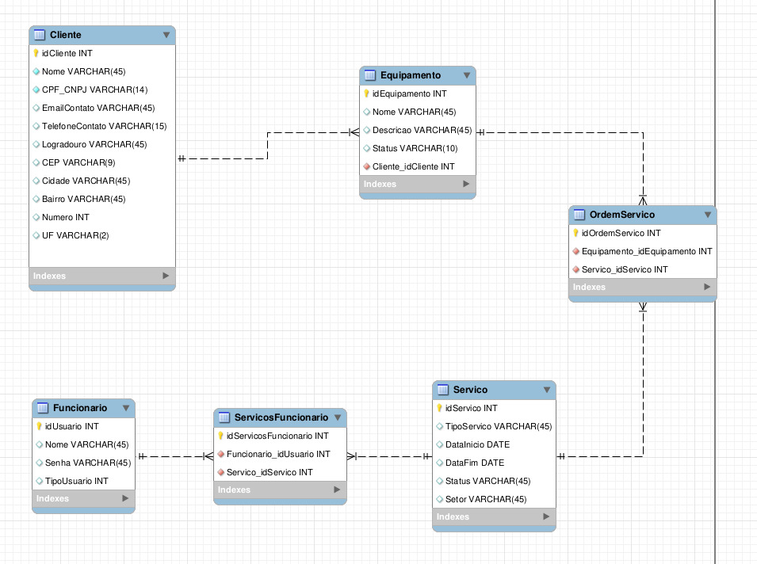

# Arquitetura da solução

<span style="color:red">Pré-requisitos: <a href="05-Projeto-interface.md"> Projeto de interface</a></span>

A arquitetura que utilizaremos para manter nossa aplicação é simples, porém, irá ser segura e confiável. Em termos simples, nossa arquitetura é constituída da seguinte maneira:

- Frontend: Desenvolvido em React JS, acessado por clientes através de navegadores web.
- Backend: Uma API desenvolvida em ASP.Net Core, rodando localmente em um servidor na empresa parceira.
- Banco de Dados: Local, utilizando MySQL, com suporte para backup.
- Fluxo de Comunicação: Os clientes (computadores e dispositivos móveis) se conectam ao servidor via rede local.

A representação da arquitetura é representada pela imagem abaixo:



## Diagrama de classes

- Cliente
   - A classe Cliente representa os dados cadastrais dos clientes que possuem equipamentos registrados no sistema.
   - Atributos principais: idCliente: Identificador único do cliente, Nome, CPF_CNPJ, EmailContato, TelefoneContato, Logradouro, CEP, Cidade, Bairro, Numero, UF.

- Equipamento
   - A classe Equipamento representa os dispositivos ou máquinas dos clientes que serão objeto das ordens de serviço.
   - Atributos principais:idEquipamento, Nome, Descricao, Status, Cliente_idCliente.

- OrdemServico
   - A classe OrdemServico registra as ordens de serviço emitidas para os equipamentos.
   - Atributos principais: idOrdemServico, Equipamento_idEquipamento, Servico_idServico.

- Servico
   - A classe Servico representa os tipos de serviços oferecidos pela empresa.
   - Atributos principais: idServico, TipoServico, DataInicio, DataFim, Status, Setor.

- Funcionario
   - A classe Funcionario armazena os dados dos usuários responsáveis pelos serviços.
   - Atributos principais: idUsuario, Nome, Senha, TipoUsuario.

-  ServicosFuncionario
   - Classe intermediária (tabela de associação) que estabelece uma relação N:N.
   - Atributos principais: idServicosFuncionario, Funcionario_idUsuario, Servico_idServico.

Relacionamentos entre classes:
 - Um cliente possui vários equipamentos.
 - Um equipamento pode ter várias ordens de serviço.
 - Uma ordem de serviço está ligada a um serviço específico.
 - Um serviço pode ser executado por vários funcionários, e um funcionário pode participar de vários serviços (relação N:N através da classe ServicosFuncionario).



## Modelo de dados

O desenvolvimento da solução proposta requer a existência de bases de dados que permitam realizar o cadastro de dados e os controles associados aos processos identificados, assim como suas recuperações.

Utilizando a notação do DER (Diagrama Entidade-Relacionamento), elaboramos um modelo ER utilizando a ferramenta "MIRO", contemplando todas as entidades e atributos associados às atividades dos processos identificados. 

Apresente o modelo de dados por meio de um modelo relacional que contemple todos os conceitos e atributos apresentados na modelagem dos processos.

### Modelo ER

O Modelo ER representa, por meio de um diagrama, como as entidades (coisas, objetos) se relacionam entre si na aplicação interativa.

> - [Diagrama de Peter Chen ](images/FixWise-PeterChen.png)

### Modelo físico

Insira aqui o script de criação das tabelas do banco de dados.

Veja nosso caso:

```sql
SET @OLD_UNIQUE_CHECKS=@@UNIQUE_CHECKS, UNIQUE_CHECKS=0;
SET @OLD_FOREIGN_KEY_CHECKS=@@FOREIGN_KEY_CHECKS, FOREIGN_KEY_CHECKS=0;
SET @OLD_SQL_MODE=@@SQL_MODE, SQL_MODE='ONLY_FULL_GROUP_BY,STRICT_TRANS_TABLES,NO_ZERO_IN_DATE,NO_ZERO_DATE,ERROR_FOR_DIVISION_BY_ZERO,NO_ENGINE_SUBSTITUTION';

-- -----------------------------------------------------
-- Schema fixwise
-- -----------------------------------------------------

-- -----------------------------------------------------
-- Schema fixwise
-- -----------------------------------------------------
CREATE DATABASE IF NOT EXISTS `fixwise` DEFAULT CHARACTER SET utf8 ;
USE `fixwise` ;

-- -----------------------------------------------------
-- Table `fixwise`.`Cliente`
-- -----------------------------------------------------
CREATE TABLE IF NOT EXISTS `fixwise`.`Cliente` (
  `idCliente` INT NOT NULL,
  `Nome` VARCHAR(45) NOT NULL,
  `CPF_CNPJ` VARCHAR(14) NOT NULL,
  `EmailContato` VARCHAR(45) NULL,
  `TelefoneContato` VARCHAR(15) NULL,
  `Logradouro` VARCHAR(45) NULL,
  `CEP` VARCHAR(9) NULL,
  `Cidade` VARCHAR(45) NULL,
  `Bairro` VARCHAR(45) NULL,
  `Numero` INT NULL,
  `UF` VARCHAR(2) NULL,
  PRIMARY KEY (`idCliente`))
ENGINE = InnoDB;

-- -----------------------------------------------------
-- Table `fixwise`.`Equipamento`
-- -----------------------------------------------------
CREATE TABLE IF NOT EXISTS `fixwise`.`Equipamento` (
  `idEquipamento` INT NOT NULL,
  `Nome` VARCHAR(45) NULL,
  `Descricao` VARCHAR(45) NULL,
  `Status` VARCHAR(10) NULL,
  `Cliente_idCliente` INT NOT NULL,
  PRIMARY KEY (`idEquipamento`),
  INDEX `fk_Equipamento_Cliente_idx` (`Cliente_idCliente` ASC) VISIBLE,
  CONSTRAINT `fk_Equipamento_Cliente`
    FOREIGN KEY (`Cliente_idCliente`)
    REFERENCES `fixwise`.`Cliente` (`idCliente`)
    ON DELETE NO ACTION
    ON UPDATE NO ACTION)
ENGINE = InnoDB;

-- -----------------------------------------------------
-- Table `fixwise`.`Funcionario`
-- -----------------------------------------------------
CREATE TABLE IF NOT EXISTS `fixwise`.`Funcionario` (
  `idUsuario` INT NOT NULL,
  `Nome` VARCHAR(45) NULL,
  `Senha` VARCHAR(45) NULL,
  `TipoUsuario` INT NULL,
  PRIMARY KEY (`idUsuario`))
ENGINE = InnoDB;

-- -----------------------------------------------------
-- Table `fixwise`.`Servico`
-- -----------------------------------------------------
CREATE TABLE IF NOT EXISTS `fixwise`.`Servico` (
  `idServico` INT NOT NULL,
  `TipoServico` VARCHAR(45) NULL,
  `DataInicio` DATE NULL,
  `DataFim` DATE NULL,
  `Status` VARCHAR(45) NULL,
  `Setor` VARCHAR(45) NULL,
  PRIMARY KEY (`idServico`))
ENGINE = InnoDB;

-- -----------------------------------------------------
-- Table `fixwise`.`OrdemServico`
-- -----------------------------------------------------
CREATE TABLE IF NOT EXISTS `fixwise`.`OrdemServico` (
  `idOrdemServico` INT NOT NULL,
  `Equipamento_idEquipamento` INT NOT NULL,
  `Servico_idServico` INT NOT NULL,
  PRIMARY KEY (`idOrdemServico`),
  INDEX `fk_OrdemServico_Equipamento1_idx` (`Equipamento_idEquipamento` ASC) VISIBLE,
  INDEX `fk_OrdemServico_Servico1_idx` (`Servico_idServico` ASC) VISIBLE,
  CONSTRAINT `fk_OrdemServico_Equipamento1`
    FOREIGN KEY (`Equipamento_idEquipamento`)
    REFERENCES `fixwise`.`Equipamento` (`idEquipamento`)
    ON DELETE NO ACTION
    ON UPDATE NO ACTION,
  CONSTRAINT `fk_OrdemServico_Servico1`
    FOREIGN KEY (`Servico_idServico`)
    REFERENCES `fixwise`.`Servico` (`idServico`)
    ON DELETE NO ACTION
    ON UPDATE NO ACTION)
ENGINE = InnoDB;

-- -----------------------------------------------------
-- Table `fixwise`.`ServicosFuncionario`
-- -----------------------------------------------------
CREATE TABLE IF NOT EXISTS `fixwise`.`ServicosFuncionario` (
  `idServicosFuncionario` INT NOT NULL,
  `Funcionario_idUsuario` INT NOT NULL,
  `Servico_idServico` INT NOT NULL,
  PRIMARY KEY (`idServicosFuncionario`),
  INDEX `fk_ServicosFuncionario_Funcionario1_idx` (`Funcionario_idUsuario` ASC) VISIBLE,
  INDEX `fk_ServicosFuncionario_Servico1_idx` (`Servico_idServico` ASC) VISIBLE,
  CONSTRAINT `fk_ServicosFuncionario_Funcionario1`
    FOREIGN KEY (`Funcionario_idUsuario`)
    REFERENCES `fixwise`.`Funcionario` (`idUsuario`)
    ON DELETE NO ACTION
    ON UPDATE NO ACTION,
  CONSTRAINT `fk_ServicosFuncionario_Servico1`
    FOREIGN KEY (`Servico_idServico`)
    REFERENCES `fixwise`.`Servico` (`idServico`)
    ON DELETE NO ACTION
    ON UPDATE NO ACTION)
ENGINE = InnoDB;

SET SQL_MODE=@OLD_SQL_MODE;
SET FOREIGN_KEY_CHECKS=@OLD_FOREIGN_KEY_CHECKS;
SET UNIQUE_CHECKS=@OLD_UNIQUE_CHECKS;
```

## Tecnologias

Descreva qual(is) tecnologias você vai usar para resolver o seu problema, ou seja, implementar a sua solução. Liste todas as tecnologias envolvidas, linguagens a serem utilizadas, serviços web, frameworks, bibliotecas, IDEs de desenvolvimento, e ferramentas.

Apresente também uma figura explicando como as tecnologias estão relacionadas ou como uma interação do usuário com o sistema vai ser conduzida, por onde ela passa até retornar uma resposta ao usuário.

| **Dimensão** | **Tecnologia**          |
| ------------ | ----------------------- |
| Front-end    | HTML + CSS + JS + React |
| Back-end     | .Asp Net Core           |
| SGBD         | MySQL                   |
| Deploy       | Localhost               |

## Hospedagem

A hospedagem na prática será rodando um servidor local, porém, para apresentação do produto, iremos utilizar algum serviço em núvem como AWS ou Azure para hospedar a aplicação e seu banco de dados.

## Qualidade de software

Para garantir a qualidade da solução, serão implementadas as seguintes práticas:

 - Testes Unitários: Testes automatizados para verificar o correto funcionamento de cada componente individualmente.
 - Testes de Integração: Testes para verificar a interação entre os diferentes componentes do sistema.
 - Revisão de Código: Inspeção do código por pares para identificar e corrigir possíveis erros e garantir a qualidade do código.
 - Análise Estática de Código: Utilização de ferramentas para identificar problemas de qualidade no código, como erros de sintaxe, vulnerabilidades de segurança e problemas de desempenho.
 - Documentação: Manutenção de documentação atualizada do sistema, incluindo a arquitetura, o modelo de dados e o código fonte.
