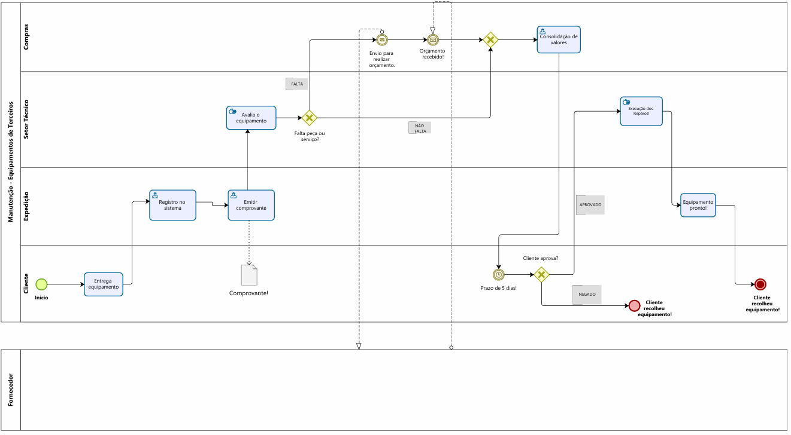

## 3.3.1 Processo 2 – AS-IS-TERCEIROS

Este processo trata da manutenção de equipamentos utilizados internamente pela empresa Porto Ferreira Locações. Atualmente, esse processo é realizado de forma manual, sem um sistema informatizado que acompanhe desde a solicitação até a finalização dos reparos.

### Oportunidades de melhoria:

Centralizar a comunicação entre setores (solicitante, manutenção, gerência).
Acompanhar o status em tempo real das solicitações e reparos.
Controlar aprovações e prazos.
Disponibilizar histórico de manutenção por equipamento.
 

### Detalhamento das atividades

_Os tipos de dados a serem utilizados são:_

_* **Área de texto** - campo texto de múltiplas linhas_

_* **Caixa de texto** - campo texto de uma linha_

_* **Número** - campo numérico_

_* **Data** - campo do tipo data (dd-mm-aaaa)_

_* **Seleção única** - campo com várias opções de valores que são mutuamente exclusivas (tradicional radio button ou combobox)_

_* **Arquivo** - upload de um arquivo_

**Entrega equipamento**

| **Campo**       | **Tipo**         | **Restrições** | **Valor default** |
| ---             | ---              | ---            | ---               |
| Descrição do equipamento | Área de texto  |   Obrigatório             |        —           |
| Data da entrega | 	Data  |   Obrigatório             |        —           |
| Nome do solicitante | Caixa de texto  |  	Somente letras           |        -         |

| **Comandos**         |  **Destino**                   | **Tipo** |
| ---                  | ---                            | ---               |
| enviar | Registro no sistema | Default |

**Registro no sistema**

| **Campo**       | **Tipo**         | **Restrições** | **Valor default** |
| ---             | ---              | ---            | ---               |
| Número da solicitação | 	Número  |        	Automático        |          —        |
|         Equipamento       |           Caixa de texto       |      	Obrigatório      |        —           |
|         Cliente       |           Caixa de texto       |      	Obrigatório      |        —           |

| **Comandos**         |  **Destino**                   | **Tipo**          |
| ---                  | ---                            | ---               |
| enviar | Emitir comprovante  | default | 

**Emitir comprovante**

| **Campo**       | **Tipo**         | **Restrições** | **Valor default** |
| ---             | ---              | ---            | ---               |
| Número do comprovante | 	Número  |        	Automático        |          —        |
|         Comprovante       |           Arquivo       |      	Obrigatório      |        —           |

| **Comandos**         |  **Destino**                   | **Tipo**          |
| ---                  | ---                            | ---               |
| enviar para cliente| Cliente  | default | 
| enviar para setor de avaliação| Avalia o equipamento  | default | 

**Avalia o equipamento**

| **Campo**       | **Tipo**         | **Restrições** | **Valor default** |
| ---             | ---              | ---            | ---               |
|         Diagnóstico       |           Área de texto       |      	Obrigatório      |        —           |
|         Falta peça ou serviço?       |           Seleção única (sim/não)       |      	Obrigatório      |        —           |
|         Técnico responsável      |           Caixa de texto       |      	Obrigatório      |        —           |

| **Comandos**         |  **Destino**                   | **Tipo**          |
| ---                  | ---                            | ---               |
| enviar | Consolidação de valores  | default |

**Consolidação de valores**

| **Campo**       | **Tipo**         | **Restrições** | **Valor default** |
| ---             | ---              | ---            | ---               |
|         Valor total       |           Caixa de texto       |      	Obrigatório      |        —           |
|         Justificativa       |          Área de texto      |      	Obrigatório      |        —           |
|         Responsável      |           Caixa de texto       |      	Obrigatório      |        —           |
|         Aprovação do cliente      |           Seleção única(sim/não)       |      	Obrigatório      |        —           |

| **Comandos**         |  **Destino**                   | **Tipo**          |
| ---                  | ---                            | ---               |
| cancelar                | FIM                           | ---               |
| enviar | Executar reparos  | default |

**Executar reparos**

| **Campo**       | **Tipo**         | **Restrições** | **Valor default** |
| ---             | ---              | ---            | ---               |
|         Técnico responsável      |           Caixa de texto       |      	Obrigatório      |        —           |
|         Ações realizadas      |          Área de texto     |      	Obrigatório      |        —           |
|         Peças substituídas      |           Área de texto       |      	Obrigatório      |        —           |
|         Data da execução    |          Data       |      	Obrigatório      |        —           |

| **Comandos**         |  **Destino**                   | **Tipo**          |
| ---                  | ---                            | ---               |
| enviar | Equipamento pronto  | default |

**Equipamento pronto**

| **Campo**       | **Tipo**         | **Restrições** | **Valor default** |
| ---             | ---              | ---            | ---               |
|         Equipamento     |           Caixa de texto       |      	Obrigatório      |        —           |
|         Cliente      |           Caixa de texto       |      	Obrigatório      |        —           |
|         Observações    |          Área de texto     |      	Obrigatório      |        —           |

| **Comandos**         |  **Destino**                   | **Tipo**          |
| ---                  | ---                            | ---               |
| enviar | FIM  | default |
